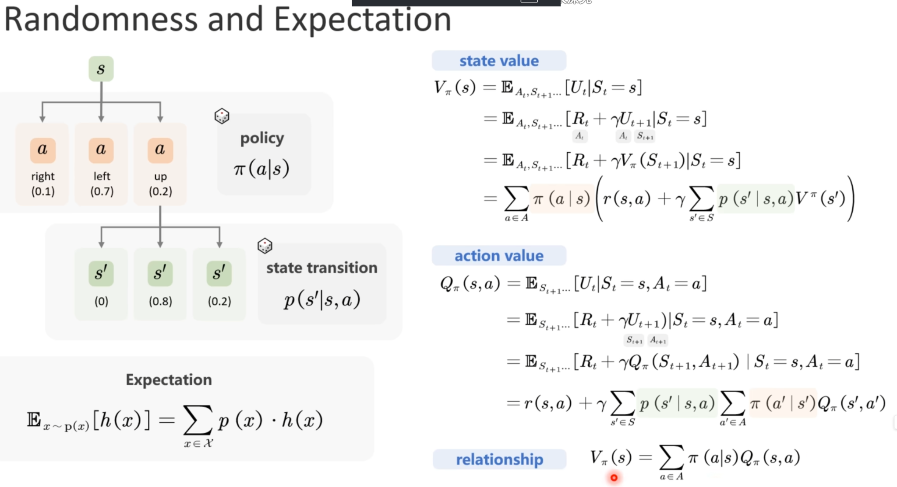
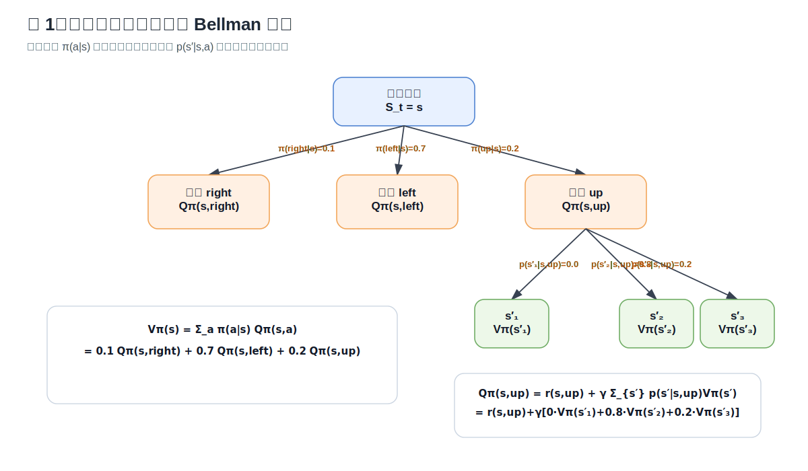
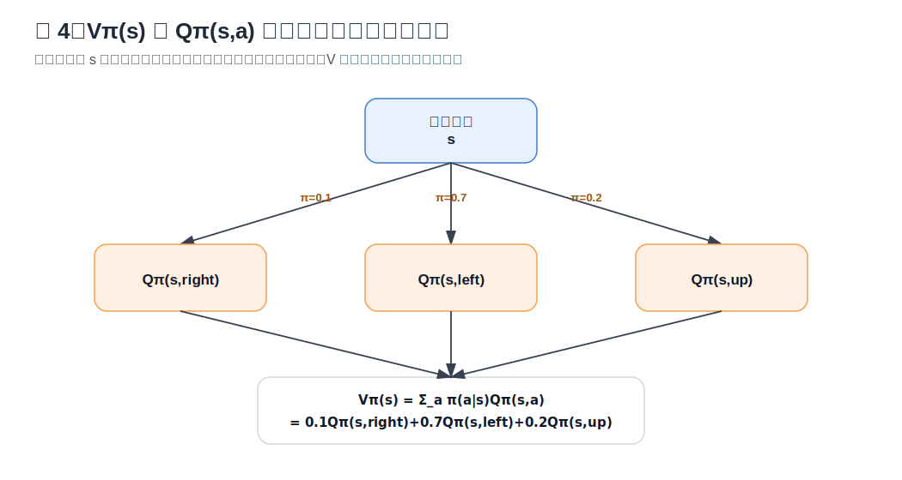
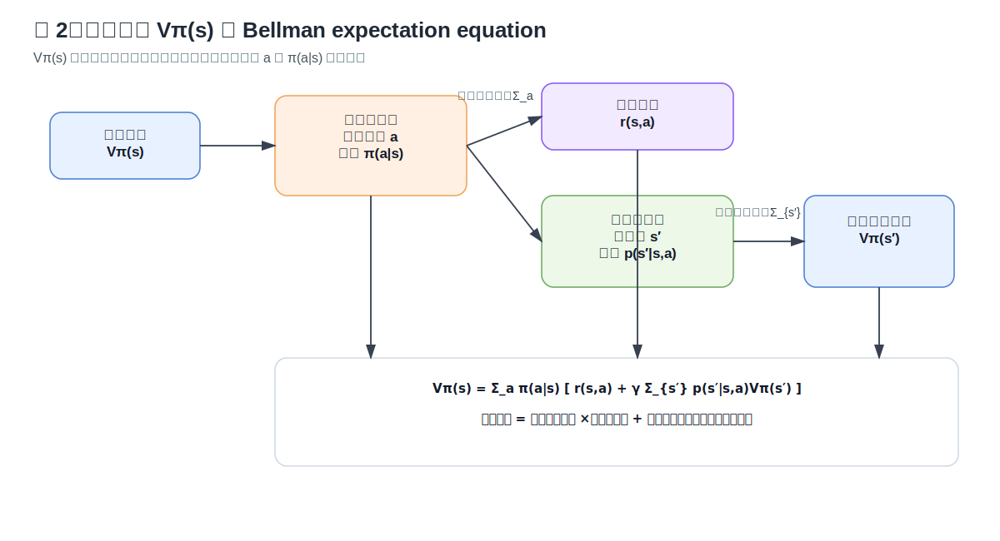
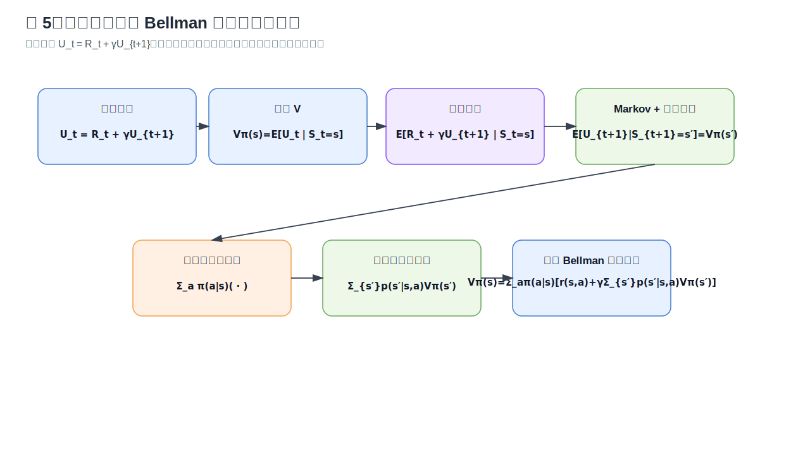
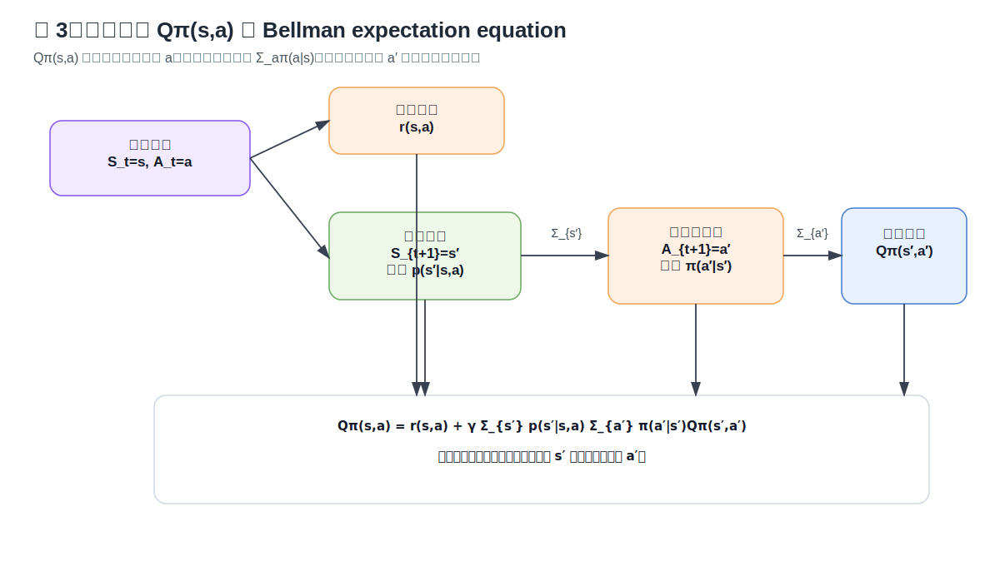

# Randomness and Expectation：Bellman Expectation Equation 公式推导

> 这份笔记解释截图里的三组公式：
>
> 1. 状态价值函数 $V_\pi(s)$ 的 Bellman expectation equation；
> 2. 动作价值函数 $Q_\pi(s,a)$ 的 Bellman expectation equation；
> 3. 二者关系 $V_\pi(s)=\sum_a \pi(a|s)Q_\pi(s,a)$。

---

## 配套图

> 本版本已经把 Mermaid 流程图改成了本地 SVG 图片引用，图片都在 `assets/` 文件夹里。





---

## 0. 先记住一句话

**强化学习里的价值函数，本质上就是“未来累计奖励的期望”。**

由于有两类随机性，所以要取期望：

1. **策略随机性**：在状态 $s$ 下，策略 $\pi(a|s)$ 可能以不同概率选择不同动作 $a$。
2. **环境随机性**：给定状态 $s$ 和动作 $a$ 后，环境可能以概率 $p(s'|s,a)$ 转移到不同下一个状态 $s'$。

所以截图里公式的核心就是：

```text
状态 s
  └─ 按策略 π(a|s) 随机选动作 a
       └─ 得到即时奖励 r(s,a)
       └─ 按环境转移 p(s'|s,a) 随机到达 s'
            └─ 从 s' 开始继续获得未来价值 Vπ(s')
```

---

## 1. 符号说明

| 符号 | 含义 |
|---|---|
| $S_t$ | 第 $t$ 步的状态，是随机变量 |
| $A_t$ | 第 $t$ 步选择的动作，是随机变量 |
| $R_t$ | 第 $t$ 步获得的即时奖励，是随机变量。很多教材也写成 $R_{t+1}$，只是下标习惯不同 |
| $s$ | 一个具体状态值 |
| $a$ | 一个具体动作值 |
| $s'$ | 下一个具体状态值，也就是 $S_{t+1}=s'$ |
| $\pi(a|s)$ | 策略：在状态 $s$ 下选择动作 $a$ 的概率 |
| $p(s'|s,a)$ | 状态转移概率：在 $s$ 下执行 $a$ 后转移到 $s'$ 的概率 |
| $r(s,a)$ | 即时奖励的期望，即 $\mathbb{E}[R_t\mid S_t=s,A_t=a]$ |
| $\gamma$ | 折扣因子，$0<\gamma<1$ |
| $U_t$ | 从时刻 $t$ 开始的折扣回报，也常写作 $G_t$ |
| $V_\pi(s)$ | 状态价值：从状态 $s$ 出发，之后按策略 $\pi$ 行动，期望能拿到多少折扣回报 |
| $Q_\pi(s,a)$ | 动作价值：从状态 $s$ 出发，第一步固定执行动作 $a$，之后按策略 $\pi$ 行动，期望能拿到多少折扣回报 |

---

## 2. 回报 $U_t$ 的递归形式

折扣回报定义为：

$$
U_t = R_t + \gamma R_{t+1} + \gamma^2 R_{t+2} + \gamma^3 R_{t+3}+\cdots
$$

把第一项 $R_t$ 拆出来，后面的部分就是从 $t+1$ 开始的回报：

$$
U_{t+1}=R_{t+1}+\gamma R_{t+2}+\gamma^2 R_{t+3}+\cdots
$$

所以：

$$
\boxed{U_t = R_t + \gamma U_{t+1}}
$$

这一步是后面所有 Bellman 方程的起点。

---

## 3. 期望公式：为什么会出现求和？

离散情况下，期望就是“概率加权平均”：

$$
\mathbb{E}_{x\sim p(x)}[h(x)] = \sum_{x\in\mathcal{X}}p(x)h(x)
$$

举个最简单的例子：

如果一个动作有 $0.8$ 的概率到达 $s_1'$，有 $0.2$ 的概率到达 $s_2'$，那么下一个状态价值的期望就是：

$$
\mathbb{E}[V_\pi(S_{t+1})]
=0.8V_\pi(s_1')+0.2V_\pi(s_2')
$$

所以 Bellman 公式里的求和不是突然冒出来的，它只是把“随机变量的期望”写成了“概率加权求和”。

---

## 4. 状态价值函数 $V_\pi(s)$ 的推导

### 4.1 定义

状态价值函数定义为：

$$
V_\pi(s)=\mathbb{E}_\pi[U_t\mid S_t=s]
$$

意思是：

> 已知当前在状态 $s$，之后一直按策略 $\pi$ 行动，那么从现在开始的折扣回报 $U_t$ 的期望是多少？

---

### 4.2 第一步：把 $U_t$ 拆成“即时奖励 + 未来回报”

由 $U_t=R_t+\gamma U_{t+1}$：

$$
V_\pi(s)
=\mathbb{E}_\pi[U_t\mid S_t=s]
=\mathbb{E}_\pi[R_t+\gamma U_{t+1}\mid S_t=s]
$$

这一步表示：

```text
当前状态价值
= 当前这一步拿到的奖励
+ 折扣后的未来回报
```

---

### 4.3 第二步：未来回报的期望可以写成下一个状态的价值

在 MDP 的 Markov 假设下，到了下一个状态 $S_{t+1}$ 之后，未来怎么发展只依赖于 $S_{t+1}$，不需要记住更早的历史。

所以：

$$
\mathbb{E}_\pi[U_{t+1}\mid S_{t+1}]
=V_\pi(S_{t+1})
$$

因此：

$$
V_\pi(s)
=\mathbb{E}_\pi[R_t+\gamma V_\pi(S_{t+1})\mid S_t=s]
$$

这一步很关键：

```text
U_{t+1} 是真实未来回报，仍然是随机的；
Vπ(S_{t+1}) 是“到达下一个状态以后，未来回报的期望”。
```

---

### 4.4 第三步：对动作随机性求期望

因为只知道当前状态是 $s$，还不知道会选哪个动作。动作由策略 $\pi(a|s)$ 随机产生。

所以先对动作 $a$ 加权求和：

$$
V_\pi(s)
=\sum_{a\in\mathcal{A}}\pi(a|s)
\mathbb{E}_\pi[R_t+\gamma V_\pi(S_{t+1})\mid S_t=s,A_t=a]
$$

这一步对应图里的第一层随机性：



---

### 4.5 第四步：对环境转移随机性求期望

给定 $S_t=s,A_t=a$ 后：

1. 即时奖励的期望是 $r(s,a)$；
2. 下一个状态 $s'$ 由 $p(s'|s,a)$ 决定；
3. 到达 $s'$ 后，未来价值是 $V_\pi(s')$。

因此：

$$
\mathbb{E}_\pi[R_t+\gamma V_\pi(S_{t+1})\mid S_t=s,A_t=a]
= r(s,a)+\gamma\sum_{s'\in\mathcal{S}}p(s'|s,a)V_\pi(s')
$$

代回去：

$$
\boxed{
V_\pi(s)
=\sum_{a\in\mathcal{A}}\pi(a|s)
\left(
    r(s,a)+\gamma\sum_{s'\in\mathcal{S}}p(s'|s,a)V_\pi(s')
\right)
}
$$

这就是 **state value 的 Bellman expectation equation**。

---

## 5. 状态价值公式的图解

整体结构可以画成这样：





对应公式：

$$
V_\pi(s)
=\underbrace{\sum_a \pi(a|s)}_{\text{对策略随机性求期望}}
\left(
\underbrace{r(s,a)}_{\text{即时奖励}}
+
\gamma
\underbrace{\sum_{s'}p(s'|s,a)V_\pi(s')}_{\text{对环境转移随机性求期望}}
\right)
$$

---

## 6. 用截图左侧的概率举一个具体形式

假设在状态 $s$ 下，策略为：

$$
\pi(\text{right}|s)=0.1,\quad
\pi(\text{left}|s)=0.7,\quad
\pi(\text{up}|s)=0.2
$$

那么：

$$
V_\pi(s)
=0.1Q_\pi(s,\text{right})
+0.7Q_\pi(s,\text{left})
+0.2Q_\pi(s,\text{up})
$$

如果执行 $\text{up}$ 后，环境转移概率为：

$$
p(s_1'|s,\text{up})=0,
\quad
p(s_2'|s,\text{up})=0.8,
\quad
p(s_3'|s,\text{up})=0.2
$$

则：

$$
Q_\pi(s,\text{up})
=r(s,\text{up})+
\gamma\left[
0\cdot V_\pi(s_1')
+0.8V_\pi(s_2')
+0.2V_\pi(s_3')
\right]
$$

所以可以直观理解为：

```text
Vπ(s)
= 不同动作价值的加权平均
= 0.1 × right 的价值
+ 0.7 × left 的价值
+ 0.2 × up 的价值
```

而某个动作的价值又是：

```text
Qπ(s,a)
= 这个动作的即时奖励
+ γ × 下一个状态价值的加权平均
```

---

## 7. 动作价值函数 $Q_\pi(s,a)$ 的推导

### 7.1 定义

动作价值函数定义为：

$$
Q_\pi(s,a)
=\mathbb{E}_\pi[U_t\mid S_t=s,A_t=a]
$$

意思是：

> 已知当前状态是 $s$，并且第一步已经固定选择动作 $a$，之后再按策略 $\pi$ 行动，那么从现在开始的折扣回报期望是多少？

注意它和 $V_\pi(s)$ 的区别：

| 函数 | 当前动作是否固定？ | 含义 |
|---|---:|---|
| $V_\pi(s)$ | 没固定 | 在状态 $s$ 下按策略随机选动作后的平均价值 |
| $Q_\pi(s,a)$ | 已固定为 $a$ | 在状态 $s$ 下先执行动作 $a$ 的价值 |

---

### 7.2 第一步：拆回报

同样由：

$$
U_t=R_t+\gamma U_{t+1}
$$

得到：

$$
Q_\pi(s,a)
=\mathbb{E}_\pi[R_t+\gamma U_{t+1}\mid S_t=s,A_t=a]
$$

---

### 7.3 第二步：用下一个状态和下一个动作的 $Q$ 表示未来

到达下一个状态 $S_{t+1}$ 后，策略会继续选择下一个动作 $A_{t+1}$。如果知道了 $S_{t+1}=s'$ 和 $A_{t+1}=a'$，那么从 $t+1$ 开始的期望回报就是：

$$
Q_\pi(s',a')
$$

所以：

$$
\mathbb{E}_\pi[U_{t+1}\mid S_{t+1},A_{t+1}]
=Q_\pi(S_{t+1},A_{t+1})
$$

因此：

$$
Q_\pi(s,a)
=\mathbb{E}_\pi[R_t+\gamma Q_\pi(S_{t+1},A_{t+1})\mid S_t=s,A_t=a]
$$

---

### 7.4 第三步：展开期望

当前动作 $a$ 已经固定，所以第一层不再有 $\sum_a\pi(a|s)$。

但是环境仍然随机转移到 $s'$，并且到达 $s'$ 后，下一步动作 $a'$ 仍然由策略 $\pi(a'|s')$ 随机选择。

所以：

$$
\boxed{
Q_\pi(s,a)
=r(s,a)
+
\gamma
\sum_{s'\in\mathcal{S}}p(s'|s,a)
\sum_{a'\in\mathcal{A}}\pi(a'|s')Q_\pi(s',a')
}
$$

这就是 **action value 的 Bellman expectation equation**。

---

## 8. 动作价值公式的图解



对应公式：

$$
Q_\pi(s,a)
=
\underbrace{r(s,a)}_{\text{当前固定动作的即时奖励}}
+
\gamma
\underbrace{\sum_{s'}p(s'|s,a)}_{\text{环境转移随机性}}
\underbrace{\sum_{a'}\pi(a'|s')Q_\pi(s',a')}_{\text{下一个状态再按策略选动作}}
$$

---

## 9. $V_\pi$ 和 $Q_\pi$ 的关系

### 9.1 从定义推导

状态价值：

$$
V_\pi(s)=\mathbb{E}_\pi[U_t\mid S_t=s]
$$

如果只知道状态 $s$，不知道动作，那么动作由策略 $\pi(a|s)$ 随机产生。因此对动作做全概率展开：

$$
V_\pi(s)
=\sum_{a\in\mathcal{A}}P(A_t=a\mid S_t=s)
\mathbb{E}_\pi[U_t\mid S_t=s,A_t=a]
$$

其中：

$$
P(A_t=a\mid S_t=s)=\pi(a|s)
$$

并且：

$$
\mathbb{E}_\pi[U_t\mid S_t=s,A_t=a]=Q_\pi(s,a)
$$

所以：

$$
\boxed{
V_\pi(s)=\sum_{a\in\mathcal{A}}\pi(a|s)Q_\pi(s,a)
}
$$

---

### 9.2 直观理解

$Q_\pi(s,a)$ 是“某个具体动作的价值”。

$V_\pi(s)$ 是“在状态 $s$ 下，按照策略 $\pi$ 可能选择不同动作，所以把各个动作价值按概率平均”。


也就是：

$$
V_\pi(s)
=\pi(a_1|s)Q_\pi(s,a_1)
+\pi(a_2|s)Q_\pi(s,a_2)
+\pi(a_3|s)Q_\pi(s,a_3)+\cdots
$$

---

## 10. 三个公式放在一起看

### 状态价值 Bellman 方程

$$
\boxed{
V_\pi(s)
=\sum_a \pi(a|s)
\left[
    r(s,a)+\gamma\sum_{s'}p(s'|s,a)V_\pi(s')
\right]
}
$$

含义：

```text
状态价值
= 先按策略平均动作
  × 每个动作的：即时奖励 + 折扣后的下一个状态价值期望
```

---

### 动作价值 Bellman 方程

$$
\boxed{
Q_\pi(s,a)
=r(s,a)+\gamma\sum_{s'}p(s'|s,a)\sum_{a'}\pi(a'|s')Q_\pi(s',a')
}
$$

含义：

```text
动作价值
= 当前固定动作的即时奖励
+ γ × 下一个状态 s' 的期望
      × 在 s' 下按策略选择下一个动作 a' 的期望
```

---

### 状态价值和动作价值关系

$$
\boxed{
V_\pi(s)=\sum_a\pi(a|s)Q_\pi(s,a)
}
$$

含义：

```text
V 是 Q 在当前策略下的加权平均。
```

---

## 11. 最容易混淆的点

### 11.1 为什么 $V_\pi(s)$ 公式里有 $\sum_a\pi(a|s)$，但 $Q_\pi(s,a)$ 一开始没有？

因为：

- $V_\pi(s)$ 只固定了状态 $s$，动作还没固定，所以要对动作求平均；
- $Q_\pi(s,a)$ 同时固定了状态 $s$ 和当前动作 $a$，所以当前这一步不需要对动作求平均。

但是 $Q_\pi(s,a)$ 里面后面仍然有：

$$
\sum_{a'}\pi(a'|s')Q_\pi(s',a')
$$

因为下一步动作 $a'$ 又是由策略随机选择的。

---

### 11.2 为什么可以把 $U_{t+1}$ 换成 $V_\pi(S_{t+1})$？

严格说不是直接把随机变量换掉，而是在取条件期望：

$$
\mathbb{E}_\pi[U_{t+1}\mid S_{t+1}=s']=V_\pi(s')
$$

也就是说：

```text
真实未来回报 U_{t+1} 有随机性；
Vπ(s') 是它在给定状态 s' 后的期望。
```

---

### 11.3 为什么可以只看 $S_{t+1}$，不看更早历史？

因为 MDP 满足 Markov property：

$$
p(S_{t+1}\mid S_t,A_t,S_{t-1},A_{t-1},\dots)=p(S_{t+1}\mid S_t,A_t)
$$

也就是说：

> 只要知道当前状态和当前动作，下一步的分布就确定了；更早的历史不再提供额外信息。

这就是 Bellman 递推能成立的关键。

---

### 11.4 如果奖励也依赖下一个状态怎么办？

上面的公式用了：

$$
r(s,a)=\mathbb{E}[R_t\mid S_t=s,A_t=a]
$$

如果你的建模里奖励写成 $r(s,a,s')$，那么状态价值公式可以写成：

$$
V_\pi(s)
=\sum_a\pi(a|s)
\sum_{s'}p(s'|s,a)
\left[
    r(s,a,s')+\gamma V_\pi(s')
\right]
$$

动作价值公式可以写成：

$$
Q_\pi(s,a)
=\sum_{s'}p(s'|s,a)
\left[
    r(s,a,s')+\gamma\sum_{a'}\pi(a'|s')Q_\pi(s',a')
\right]
$$

本质没有变，只是即时奖励也被放进了对 $s'$ 的期望里。

---

## 12. 用一句话总结

Bellman expectation equation 的本质是：

$$
\text{当前价值}
=
\text{即时奖励的期望}
+
\gamma\times \text{下一步价值的期望}
$$

其中：

- 对动作求期望，用 $\pi(a|s)$；
- 对状态转移求期望，用 $p(s'|s,a)$；
- $V_\pi(s)$ 是“状态的平均价值”；
- $Q_\pi(s,a)$ 是“固定当前动作后的价值”；
- $V_\pi(s)$ 是 $Q_\pi(s,a)$ 按当前策略的加权平均。


---

## 附录：本地 SVG 图片文件

本笔记引用了以下图片：

| 图片 | 用途 |
|---|---|
| `assets/original_slide.png` | 原始截图 |
| `assets/expectation_tree.svg` | 两层随机性：策略随机性 + 环境随机性 |
| `assets/state_value_bellman.svg` | 状态价值 Bellman 方程图解 |
| `assets/action_value_bellman.svg` | 动作价值 Bellman 方程图解 |
| `assets/vq_relationship.svg` | $V_\pi$ 与 $Q_\pi$ 的关系 |
| `assets/derivation_route.svg` | 从回报递归到 Bellman 方程的推导路线 |
