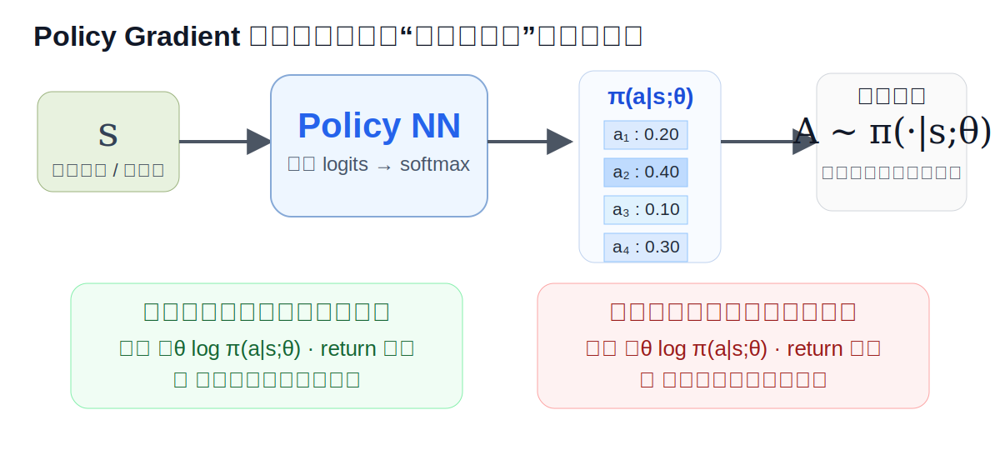
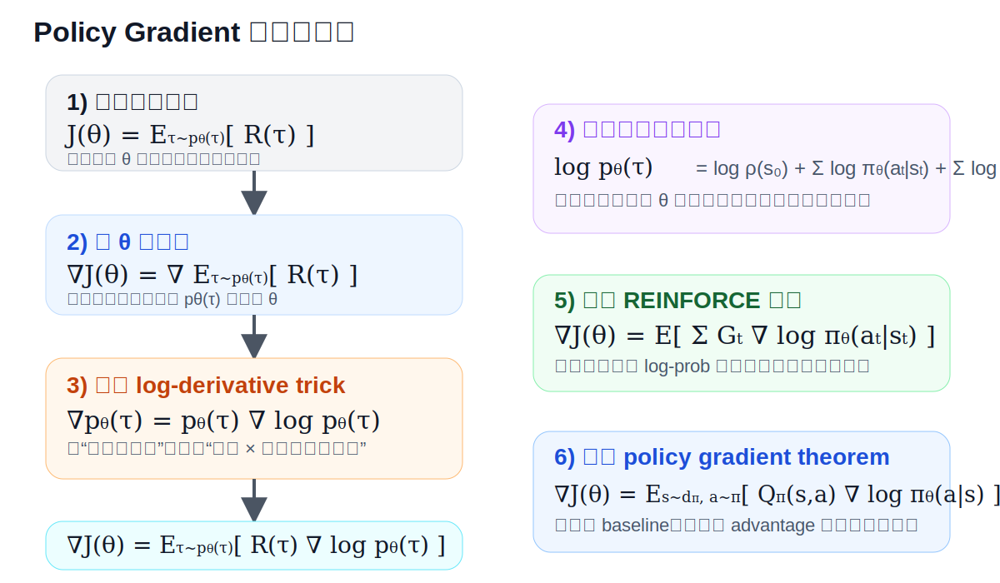
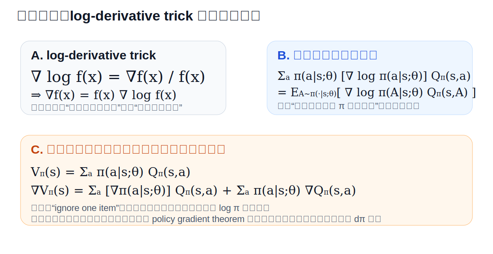
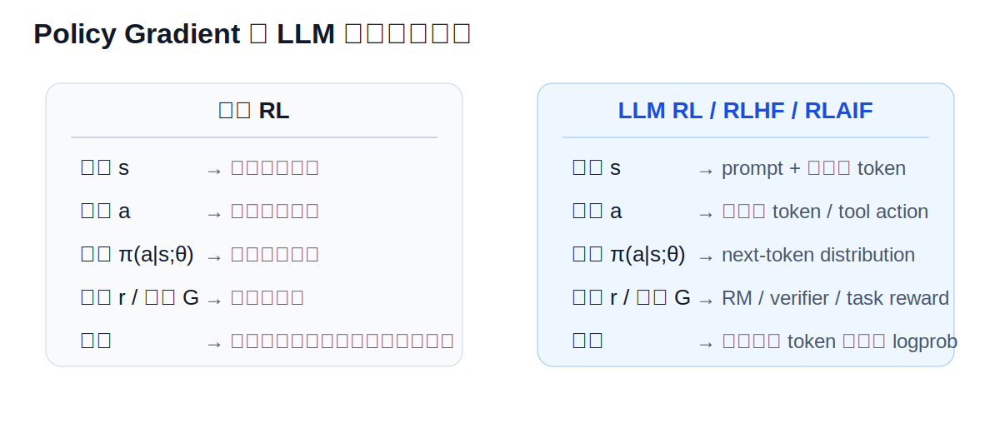

# Policy Gradient 公式推导详解（通俗版 + 专业版）

> 目标：解释你截图里的 **Policy Gradient** 公式是怎么来的、每一步为什么这么写、哪些是直觉理解，哪些是更严格的专业推导。
>
> 本文先讲**通俗易懂版**，再讲**专业推导版**，并配上本地 SVG 图示，方便离线查看。

---

## 0. 配图索引

### 原始课件截图

### 图 1：Policy Gradient 的直观图

### 图 2：推导路线图

### 图 3：关键技巧与“ignore one item”说明

### 图 4：在 LLM 里的对应关系

---

# 1. 先用通俗的话讲清楚：Policy Gradient 到底在干什么？

一句话概括：

> **如果某个动作最终带来了高回报，就让模型以后更倾向于再做这个动作；如果某个动作带来了低回报，就让模型以后更不倾向于做这个动作。**

这就是 policy gradient 的核心直觉。

我们把策略写成：

$$
\pi(a\mid s;\theta)
$$

意思是：

- 在状态 $s$ 下；
- 采取动作 $a$ 的概率；
- 这个概率由参数 $\theta$ 决定。

所以训练 policy，其实就是训练参数 $\theta$，让“好动作”的概率变大，“坏动作”的概率变小。

---

## 1.1 为什么它叫“policy gradient”？

因为我们直接优化的是**策略本身**（policy），不是先学一个 value 再间接选动作。

而 “gradient” 的意思是：

> 看一看如果把参数 $\theta$ 稍微改一点，最终总回报 $J(\theta)$ 会往哪个方向变化得更快。

于是我们就沿着这个方向去更新参数：

$$
\theta_{new} \leftarrow \theta_{old} + \beta \, \nabla_\theta J(\theta_{old})
$$

这里：

- $\beta$ 是学习率；
- $\nabla_\theta J(\theta)$ 是目标函数对参数的梯度；
- 因为我们是**最大化**回报，所以用的是 **gradient ascent**（梯度上升）。

---

## 1.2 它和监督学习的直觉区别是什么？

监督学习：

- 有标准答案；
- 看 prediction 和 label 差多少；
- 然后反向传播。

强化学习：

- 没有每一步的标准标签；
- 只有执行完动作后，最后拿到一个 reward / return；
- 再反过来问：**哪些动作对这个结果有贡献？**

所以 policy gradient 本质上在做：

> **用回报来“给动作打分”，再把这个分数转成对 log-prob 的更新信号。**

---

# 2. 这张课件里的每一部分在说什么？

## 2.1 左上角：神经网络输出策略

课件左上角画的是：

$$
s \rightarrow \text{NN} \rightarrow \text{Softmax} \rightarrow \pi(\cdot \mid s;\theta)
$$

含义：

1. 输入当前状态 $s$；
2. 神经网络输出一组 logits；
3. 用 softmax 变成动作概率分布；
4. 得到策略 $\pi(\cdot \mid s;\theta)$。

例如某个状态下：

- 动作 1 概率 0.2
- 动作 2 概率 0.4
- 动作 3 概率 0.1
- 动作 4 概率 0.3

那么 agent 就按照这个概率分布去采样动作。

---

## 2.2 左下角：要最大化 return

课件写的是：

$$
J(\theta)=\mathbb{E}_S[V_\pi(S)] = \mathbb{E}_{\tau\sim p_\theta(\tau)}\left[\sum_t \gamma^t r(s_t,a_t)\right]
$$

这表示我们的优化目标是：

> 让由策略 $\pi_\theta$ 生成的轨迹，平均总回报尽量大。

这里：

- $\tau$ 表示一条 trajectory（轨迹）；
- $p_\theta(\tau)$ 表示轨迹在当前策略下出现的概率；
- $\sum_t \gamma^t r(s_t,a_t)$ 是这条轨迹的 discounted return。

通俗地说：

> 你想把“模型平均能拿到多少分”这个东西尽量提高。

---

## 2.3 右上角：复合函数求导的关键技巧

课件写：

$$
\nabla \ln f(x)=\frac{\nabla f(x)}{f(x)}
$$

等价于：

$$
\nabla f(x)=f(x)\nabla \ln f(x)
$$

这一步非常重要，叫 **log-derivative trick** 或 **score function trick**。

它的作用是：

> 把“概率分布本身的导数”，变成“对数概率的导数”，这样就能把梯度写成一个期望，方便采样估计。

这个技巧几乎是 REINFORCE / policy gradient 最核心的一步。

---

## 2.4 右侧：从状态价值出发的局部推导

课件右边从：

$$
V_\pi(s)=\sum_a \pi(a\mid s;\theta)Q_\pi(s,a)
$$

开始，对 $\theta$ 求导。

通俗理解就是：

> 一个状态值等于：该状态下所有动作的价值，按动作概率加权平均。

既然动作概率由 $\theta$ 决定，那当然可以对它求导，看看改参数后，状态价值会怎么变化。

---

# 3. 最应该记住的本质结论

如果你只背一个结论，请背这个：

$$
\nabla_\theta J(\theta)
=
\mathbb{E}\left[\sum_t G_t\,\nabla_\theta \log \pi_\theta(a_t\mid s_t)\right]
$$

它的含义是：

- 对一条采样轨迹上的每一步；
- 看这一步动作的 log-prob 梯度；
- 再用这一步之后的回报 $G_t$ 去加权；
- 回报高，就往“增大该动作概率”的方向更新；
- 回报低，就往“减小该动作概率”的方向更新。

再压缩成一句话就是：

> **让高回报动作的 logprob 上升，让低回报动作的 logprob 下降。**

---

# 4. 专业角度：从目标函数严格推导到 REINFORCE

下面开始正式推导。

## 4.1 定义目标函数

定义一条轨迹：

$$
\tau=(s_0,a_0,s_1,a_1,\dots,s_T,a_T)
$$

轨迹的回报：

$$
R(\tau)=\sum_{t=0}^T \gamma^t r(s_t,a_t)
$$

我们要最大化的目标函数：

$$
J(\theta)=\mathbb{E}_{\tau\sim p_\theta(\tau)}[R(\tau)]
$$

展开成求和形式：

$$
J(\theta)=\sum_\tau p_\theta(\tau) R(\tau)
$$

这里最重要的是：**轨迹概率 $p_\theta(\tau)$ 依赖策略参数 $\theta$。**

---

## 4.2 对目标函数求梯度

$$
\nabla_\theta J(\theta)
=
\nabla_\theta \sum_\tau p_\theta(\tau)R(\tau)
=
\sum_\tau \nabla_\theta p_\theta(\tau)R(\tau)
$$

注意：

- $R(\tau)$ 是轨迹得到的回报；
- 一般不直接依赖参数 $\theta$；
- 所以导数只作用在 $p_\theta(\tau)$ 上。

---

## 4.3 用 log-derivative trick

根据：

$$
\nabla f = f \nabla \log f
$$

令 $f = p_\theta(\tau)$，得到：

$$
\nabla_\theta p_\theta(\tau)
=
p_\theta(\tau)\nabla_\theta \log p_\theta(\tau)
$$

代回去：

$$
\nabla_\theta J(\theta)
=
\sum_\tau p_\theta(\tau) \nabla_\theta \log p_\theta(\tau) R(\tau)
$$

于是变成期望形式：

$$
\nabla_\theta J(\theta)
=
\mathbb{E}_{\tau\sim p_\theta(\tau)}\left[R(\tau)\nabla_\theta\log p_\theta(\tau)\right]
$$

这一步非常关键，因为它告诉我们：

> 只要能从当前策略采样轨迹，就能用采样来估计梯度。

---

## 4.4 展开轨迹概率

一条轨迹的概率可以写成：

$$
p_\theta(\tau)
=
\rho(s_0)
\prod_{t=0}^{T}
\pi_\theta(a_t\mid s_t)
\,p(s_{t+1}\mid s_t,a_t)
$$

其中：

- $\rho(s_0)$ 是初始状态分布；
- $\pi_\theta(a_t\mid s_t)$ 是策略；
- $p(s_{t+1}\mid s_t,a_t)$ 是环境转移概率。

取对数：

$$
\log p_\theta(\tau)
=
\log \rho(s_0)
+
\sum_t \log \pi_\theta(a_t\mid s_t)
+
\sum_t \log p(s_{t+1}\mid s_t,a_t)
$$

对 $\theta$ 求导：

$$
\nabla_\theta \log p_\theta(\tau)
=
\sum_t \nabla_\theta \log \pi_\theta(a_t\mid s_t)
$$

因为：

- 初始分布 $\rho(s_0)$ 不依赖 $\theta$；
- 环境转移概率 $p(s_{t+1}\mid s_t,a_t)$ 也不依赖 $\theta$；
- 只有策略项依赖 $\theta$。

代入上一步：

$$
\nabla_\theta J(\theta)
=
\mathbb{E}_{\tau\sim p_\theta(\tau)}
\left[
R(\tau)
\sum_t \nabla_\theta \log \pi_\theta(a_t\mid s_t)
\right]
$$

这就是最基础的 policy gradient 形式。

---

## 4.5 从整条轨迹回报换成每一步之后的回报

注意，某个时刻 $t$ 的动作 $a_t$ 不可能影响过去的 reward，只会影响将来的 reward。

所以我们可以把整条轨迹回报 $R(\tau)$ 换成从时刻 $t$ 开始的 return：

$$
G_t=\sum_{k=t}^{T}\gamma^{k-t}r(s_k,a_k)
$$

因此，常写成：

$$
\nabla_\theta J(\theta)
=
\mathbb{E}\left[
\sum_t G_t\,\nabla_\theta \log \pi_\theta(a_t\mid s_t)
\right]
$$

这就是 **REINFORCE** 公式。

它比“整条轨迹一个总分数”更合理，因为每一步动作只该对它后面的结果负责。

---

# 5. 从课件右侧的“状态级公式”来理解

现在回到课件右边那条公式链。

## 5.1 从状态价值开始

$$
V_\pi(s)=\sum_{a\in A}\pi(a\mid s;\theta)Q_\pi(s,a)
$$

这就是：

> 在状态 $s$ 下，状态价值等于动作价值的概率加权平均。

对 $\theta$ 求梯度，严格来说应该用乘法法则：

$$
\nabla_\theta V_\pi(s)
=
\sum_a \nabla_\theta\big(\pi(a\mid s;\theta)Q_\pi(s,a)\big)
$$

展开：

$$
\nabla_\theta V_\pi(s)
=
\sum_a \Big(\nabla_\theta\pi(a\mid s;\theta)\cdot Q_\pi(s,a)
+
\pi(a\mid s;\theta)\cdot \nabla_\theta Q_\pi(s,a)\Big)
$$

也就是两项：

1. 策略概率变了带来的影响；
2. 动作价值本身也会随着策略变而变。

---

## 5.2 为什么课件说 “ignore one item”？

课件里把第二项暂时忽略，得到近似：

$$
\nabla_\theta V_\pi(s)
\approx
\sum_a \nabla_\theta\pi(a\mid s;\theta)\,Q_\pi(s,a)
$$

这是为了先把最关键的 **log-prob trick** 展示出来。

然后利用：

$$
\nabla_\theta \pi(a\mid s;\theta)
=
\pi(a\mid s;\theta)\nabla_\theta\log\pi(a\mid s;\theta)
$$

代入得到：

$$
\nabla_\theta V_\pi(s)
\approx
\sum_a
\pi(a\mid s;\theta)
\nabla_\theta\log\pi(a\mid s;\theta)
Q_\pi(s,a)
$$

再把“按 $\pi$ 加权求和”写成期望：

$$
\nabla_\theta V_\pi(s)
\approx
\mathbb{E}_{A\sim\pi(\cdot\mid s;\theta)}
\left[
\nabla_\theta\log\pi(A\mid s;\theta)Q_\pi(s,A)
\right]
$$

这就是课件最右下角那一行。

---

## 5.3 这一页的推导为什么不是最严格的完整证明？

因为严格来说，$Q_\pi(s,a)$ 本身也依赖 $\theta$，不能真的直接“扔掉”第二项。

更严谨的做法是：

1. 从轨迹分布 $p_\theta(\tau)$ 出发；
2. 推出 REINFORCE；
3. 再得到 policy gradient theorem。

课件这一页的目的更像是：

> 让你先看懂为什么最后会出现 **$\nabla \log \pi$ 乘上一个价值项** 这样的结构。

所以它更偏**启发式说明**，不是最严谨的证明版本。

---

# 6. 更专业一点：Policy Gradient Theorem

更标准的结果是：

$$
\nabla_\theta J(\theta)
=
\mathbb{E}_{s\sim d^\pi,\,a\sim\pi_\theta}
\left[
Q_\pi(s,a)\nabla_\theta\log\pi_\theta(a\mid s)
\right]
$$

其中：

- $d^\pi(s)$ 是在策略 $\pi$ 下的状态访问分布（discounted visitation distribution）；
- $Q_\pi(s,a)$ 是动作价值函数。

它的意思是：

> 在所有会访问到的状态上，按照策略采样动作，用动作价值 $Q_\pi(s,a)$ 作为权重，去更新动作的 log-prob。

这个定理的重要意义在于：

> 梯度里不需要显式写出环境转移概率对参数的导数，也不需要显式处理 $\nabla_\theta Q_\pi(s,a)$ 那一大坨复杂项。

这就是 policy gradient theorem 的精髓。

---

# 7. 为什么实际里经常换成 advantage？

如果直接用 $Q_\pi(s,a)$ 或 $G_t$，方差往往很大。

所以通常减去一个 baseline：

$$
A_\pi(s,a)=Q_\pi(s,a)-V_\pi(s)
$$

于是梯度写成：

$$
\nabla_\theta J(\theta)
=
\mathbb{E}\left[A_\pi(s,a)\nabla_\theta\log\pi_\theta(a\mid s)\right]
$$

它的直觉是：

- 如果这个动作比平均水平更好，advantage 为正，概率上升；
- 如果这个动作比平均水平更差，advantage 为负，概率下降。

这比只看绝对 return 更稳定。

---

# 8. 在 LLM 里的映射

把它映射到 LLM RL / RLHF 里：

- 状态 $s$：prompt + 已生成 token + 工具观测；
- 动作 $a$：下一个 token，或者一次 tool action；
- 策略 $\pi_\theta(a\mid s)$：LLM 的 next-token distribution；
- 回报 $G_t$：答案质量、reward model 分数、verifier、任务成功与否；
- 更新：让高质量 token / 轨迹的 logprob 增大。

所以在 LLM 里，policy gradient 的一句话版本是：

> **把“生成得好”的 token 轨迹概率提高，把“生成得差”的 token 轨迹概率降低。**

---

# 9. 这页内容在 “RL in LLM” 里的重要性

## 9.1 这页真正覆盖了什么？

它覆盖了：

- policy 是概率分布；
- 目标是最大化 expected return；
- log-derivative trick；
- 为什么梯度里会出现 $\nabla \log \pi$；
- 为什么会用 return / Q 来给动作加权。

这些都是 **PPO / GRPO / REINFORCE / actor-critic** 的共同底层。

---

## 9.2 它还没覆盖什么？

它还没有正式展开：

- baseline / advantage 的更系统推导；
- value function 如何估计；
- actor-critic；
- PPO 的 clip objective；
- KL regularization；
- GRPO 的 group-relative advantage；
- LLM 场景里的 token-level credit assignment。

所以这页内容很重要，但它属于：

> **“为什么策略梯度能成立”的基础层**。

而不是 LLM RL 的全部。

---

# 10. 最后帮你总结：哪些必须记，哪些是推导过程

## 10.1 最需要记住的结论

### 结论 1：优化目标

$$
J(\theta)=\mathbb{E}_{\tau\sim p_\theta(\tau)}[R(\tau)]
$$

意思：最大化策略产生轨迹的平均回报。

### 结论 2：REINFORCE 形式

$$
\nabla_\theta J(\theta)
=
\mathbb{E}\left[\sum_t G_t\nabla_\theta\log\pi_\theta(a_t\mid s_t)\right]
$$

意思：让高回报动作的 logprob 上升。

### 结论 3：Policy Gradient Theorem

$$
\nabla_\theta J(\theta)
=
\mathbb{E}_{s,a}\left[Q_\pi(s,a)\nabla_\theta\log\pi_\theta(a\mid s)\right]
$$

意思：用动作价值给 logprob 梯度加权。

### 结论 4：Advantage 版本（实际更常见）

$$
\nabla_\theta J(\theta)
=
\mathbb{E}_{s,a}\left[A_\pi(s,a)\nabla_\theta\log\pi_\theta(a\mid s)\right]
$$

意思：比平均更好的动作就鼓励，比平均更差的动作就惩罚。

---

## 10.2 属于推导过程的东西

这些主要是推导工具：

1. 把目标写成轨迹期望；
2. 对轨迹概率求导；
3. 用 log-derivative trick：
   $$
   \nabla p = p\nabla\log p
   $$
4. 展开：
   $$
   \log p_\theta(\tau)=\sum_t \log \pi_\theta(a_t\mid s_t)+\text{与 }\theta\text{ 无关的项}
   $$
5. 把整条轨迹回报换成每一步之后的 return $G_t$。

这些不一定要逐字背，但一定要理解它们各自干了什么。

---

## 10.3 课件右边那条局部推导要怎么看

你可以把它当成：

> **帮助你看懂为什么最终会出现 “$\nabla \log \pi \times Q$” 这种结构。**

而不要把它当成最严格版本的证明。

如果你要做考试、读论文、看 PPO/GRPO 代码，那么真正最应该牢牢记住的是：

1. $J(\theta)$ 是 expected return；
2. $\nabla J$ 能写成 expectation；
3. expectation 里会出现 $\nabla \log \pi$；
4. 它前面乘的是 return / Q / advantage。

---

# 11. 一页超短记忆版

如果你想最后只记一个极简版本，就记下面这四行：

$$
J(\theta)=\mathbb{E}_{\tau\sim p_\theta(\tau)}[R(\tau)]
$$

$$
\nabla p = p\nabla \log p
$$

$$
\nabla_\theta J(\theta)
=
\mathbb{E}\left[\sum_t G_t\nabla_\theta\log\pi_\theta(a_t\mid s_t)\right]
$$

$$
\text{高回报动作升概率，低回报动作降概率}
$$

这就是 policy gradient 的本质。

---

# 12. 文件说明

本目录包含：

- `policy_gradient_derivation_with_svg.md`：主讲义，引用本地 SVG；
- `assets/original_slide.png`：你提供的原始截图；
- `assets/policy_gradient_intuition.svg`：直观图；
- `assets/policy_gradient_derivation_map.svg`：推导路线图；
- `assets/policy_gradient_key_tricks.svg`：关键技巧图；
- `assets/policy_gradient_llm_mapping.svg`：LLM 对应关系图。

只要保持 markdown 和 `assets/` 文件夹的相对位置不变，图片就能正常显示。
